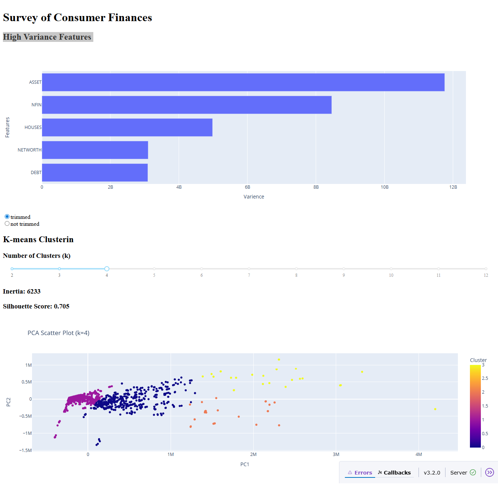

# K-Means Dashboard - Interactive Data Clustering Visualization

An interactive web dashboard for exploring K-means clustering on the Survey of Consumer Finances (SCF) dataset. This application provides real-time visualization of clustering results with customizable parameters and principal component analysis.



## 🚀 Features

- **Interactive Variance Analysis**: Explore the highest variance features in the dataset with optional trimmed variance calculation
- **Dynamic K-Means Clustering**: Adjust the number of clusters (k=2 to k=12) in real-time
- **PCA Visualization**: 2D scatter plot visualization using Principal Component Analysis
- **Performance Metrics**: Real-time calculation of inertia and silhouette scores
- **Responsive UI**: Built with Dash and Plotly for smooth user interactions

## 📊 Dataset

This project uses the **Survey of Consumer Finances (SCF) 2022** dataset from Kaggle, specifically focusing on:
- Credit-fearful households
- Net worth less than $2 million
- Multiple financial features for clustering analysis

## 🛠️ Technology Stack

- **Python 3.x**
- **Dash** - Web application framework
- **Plotly Express** - Interactive plotting
- **Scikit-learn** - Machine learning algorithms
- **Pandas** - Data manipulation
- **KaggleHub** - Dataset loading
- **SciPy** - Statistical functions

## 📋 Prerequisites

Make sure you have Python 3.x installed on your system.

## 🔧 Installation

1. **Clone the repository**:
   ```bash
   git clone <your-repository-url>
   cd kmeans_dashboard
   ```

2. **Install required dependencies**:
   ```bash
   pip install dash plotly pandas scikit-learn scipy kagglehub
   ```

   Or install KaggleHub with pandas support:
   ```bash
   pip install kagglehub[pandas-datasets]
   ```

## 🚀 Usage

1. **Run the application**:
   ```bash
   python interactive_kmeans_dashboard.py
   ```

2. **Open your web browser** and navigate to:
   ```
   http://127.0.0.1:8050/
   ```

3. **Interact with the dashboard**:
   - Toggle between trimmed and non-trimmed variance calculations
   - Adjust the number of clusters using the slider (k=2 to k=12)
   - View real-time updates of clustering metrics and visualizations

## 📈 Dashboard Components

### 1. High Variance Features Bar Chart
- Displays the five highest-variance features in the dataset
- Option to use trimmed variance (removes top and bottom 10% of observations)
- Horizontal bar chart for easy comparison

### 2. K-Means Clustering Controls
- **Variance Calculation Toggle**: Choose between trimmed and standard variance
- **Cluster Number Slider**: Adjust k from 2 to 12 clusters
- **Real-time Metrics**: Displays inertia and silhouette scores

### 3. PCA Scatter Plot
- 2D visualization of clustering results using Principal Component Analysis
- Color-coded clusters for easy identification
- Updates dynamically based on selected parameters

## 🔍 Key Functions

### Data Processing
- `wrangle(df)`: Filters the dataset for credit-fearful households with net worth < $2M
- `get_high_var_features()`: Identifies the five highest-variance features

### Machine Learning
- `get_model_metrics()`: Builds and evaluates K-means models
- `get_pca_labels()`: Performs PCA transformation for visualization

### Visualization
- `serve_bar_chart()`: Creates variance feature bar charts
- `serve_scatter_plot()`: Generates PCA scatter plots
- `serve_metrics()`: Displays clustering performance metrics

## 📊 Model Evaluation Metrics

- **Inertia**: Sum of squared distances from each point to its cluster centroid
- **Silhouette Score**: Measure of cluster cohesion and separation (-1 to 1, higher is better)

## 🎯 Use Cases

- **Financial Data Analysis**: Explore patterns in consumer financial behavior
- **Market Segmentation**: Identify distinct groups of credit-fearful consumers
- **Educational Tool**: Learn about K-means clustering and PCA visualization
- **Research**: Investigate clustering performance across different parameter settings

## 📁 Project Structure

```
kmeans_dashboard/
├── interactive_kmeans_dashboard.py  # Main application file
├── Dash-09-01-2025_04_42_PM.png    # Dashboard screenshot
└── README.md                       # Project documentation
```

## 🔄 Data Flow

1. **Data Loading**: KaggleHub loads the SCF 2022 dataset
2. **Data Filtering**: Applied to credit-fearful households with specific net worth criteria
3. **Feature Selection**: Identifies highest-variance features (trimmed or standard)
4. **Model Training**: K-means clustering with standardized features
5. **Dimensionality Reduction**: PCA for 2D visualization
6. **Interactive Visualization**: Real-time updates based on user inputs

## 🐛 Troubleshooting

**Common Issues:**

1. **Dataset Loading Error**: Ensure you have internet connection for KaggleHub
2. **Port Already in Use**: Change the port in `app.run(debug=True, port=8051)`
3. **Missing Dependencies**: Install all required packages using pip

**Performance Tips:**
- For large datasets, consider sampling for faster rendering
- Adjust the k-slider range based on your data size
- Use trimmed variance for more robust feature selection

## 🤝 Contributing

1. Fork the repository
2. Create a feature branch (`git checkout -b feature/amazing-feature`)
3. Commit your changes (`git commit -m 'Add amazing feature'`)
4. Push to the branch (`git push origin feature/amazing-feature`)
5. Open a Pull Request

## 📄 License

This project is licensed under the MIT License - see the LICENSE file for details.

## 🙏 Acknowledgments

- **Kaggle** for providing the Survey of Consumer Finances dataset
- **Plotly/Dash** team for the excellent visualization framework
- **Scikit-learn** contributors for machine learning tools

## 📧 Contact

For questions or suggestions, please open an issue in the repository.

---

**Happy Clustering! 🎯**